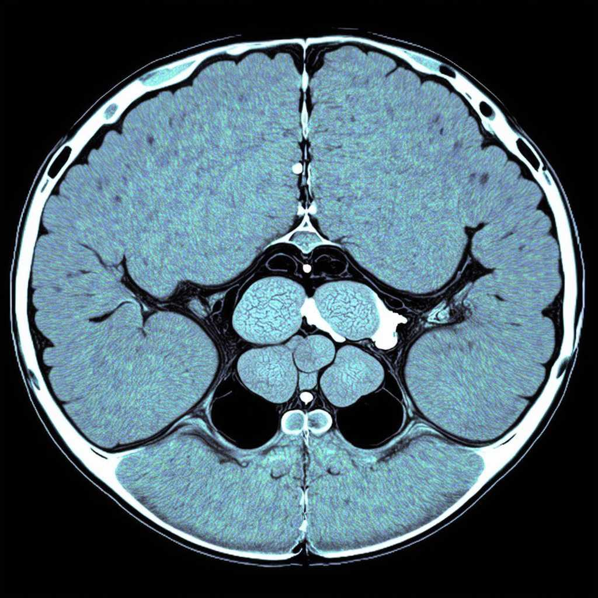
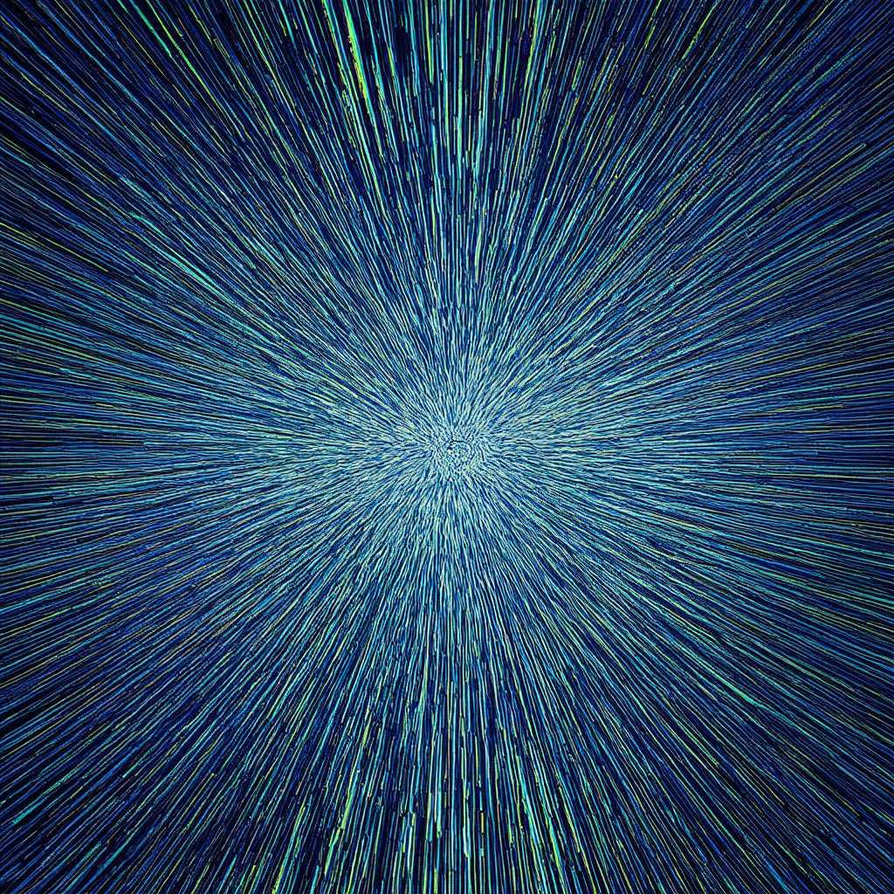

## Portfolio

---

### Highlighted projects in data science, machine learning, and natural language processing (NLP)

[Tumor Detection and Segmentation in MRI Scans the gut Area](https://www.kaggle.com/code/ollatunji/tumor-detection-in-mri-scans-v2)

    

[View code on Kaggle](https://www.kaggle.com/code/ollatunji/tumor-detection-in-mri-scans-v2)

---
[Gravitational Wave Analysis and Detection ](/pdf/sample_presentation.pdf)

---
[Hourly/Minutes Bitcoin Prediction](http://example.com/)

---

### Highlighted projects in Software Development

- [Translation app](http://example.com/)
- [Weather app](http://example.com/)
- [Blog App](http://example.com/)
- [E-commerce app](http://example.com/)
- [Social Media App](http://example.com/)

---

---

